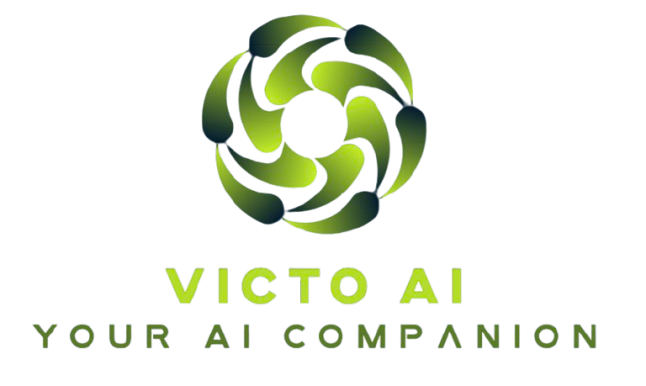
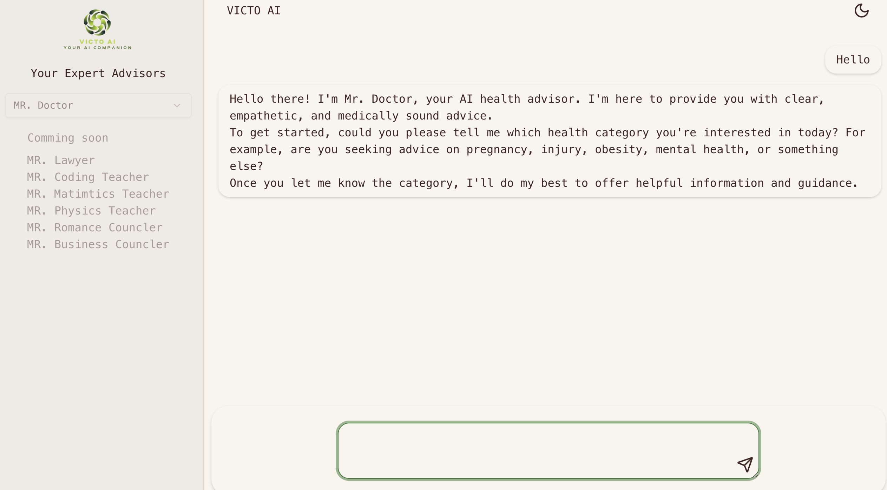

# VICTO AI



An AI-powered application that integrates Gemini to deliver real-time, multi-conversation chat streaming using APIs provided by Google Gemini. The app features a range of virtual experts—including doctors, lawyers, and teachers—each trained to provide professional advice within their field. Users can choose an expert based on their needs and begin interactive conversations instantly.

## Table of Contents

- [Features](#features)
- [Technologies Used](#technologies-used)
- [Installation](#installation)
- [API Reference](#api-reference)
- [Screeen Shoot](#api-reference)

## Features

- Chat with text
- Chat Streaming
- Mobile Responsive
- Dark and Light Mode theme
- Different experts 

## Technologies Used

- [Next.js](https://nextjs.org/)
- [zustand](https://zustand.docs.pmnd.rs/getting-started/introduction)
- [Tailwindcss](https://tailwindcss.com/)
- [Shadcn-Ui](https://ui.shadcn.com/)
- [Google Gemini ](https://ai.google.dev/gemini-api/docs/text-generation)
- [React Mark down](https://www.npmjs.com/package/react-markdown)


## Installation

1. Clone the repository:
   ```bash
   git clone https://github.com/victocoder/victo-ai.git
   ```
2. Navigate into the project directory:
   ```bash
   cd victo-ai
   ```
3. Install the dependencies:
   ```bash
   npm install
   ```
4. Run the application:
   ```bash
   npm run dev
   ```

## API Reference

### Endpoint 1

**GET** `/api/gemini`

- Description: Accepts user prompt and returns gemini response after asking gemini with the prompt
- Parameters: 
  - `prompt`: the text enterd by the user as a prompt for the ai model.
- Response: 
  ```json
  {
    message: "gimini responded ",
    response: "long string text responeded by gemini"
  }
  ```

  ## Screen Shoot

  